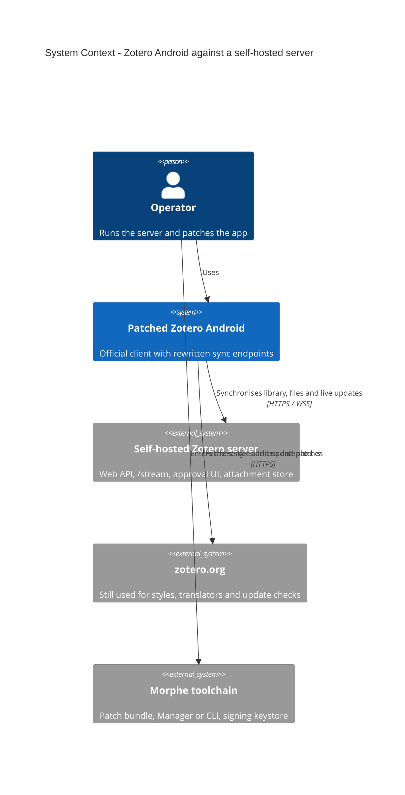
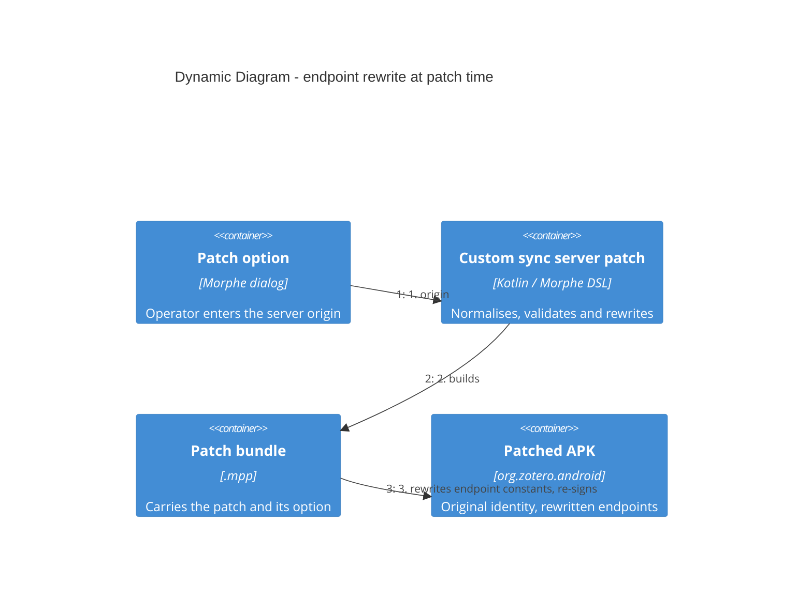

## Context

The target is the official Zotero Android app, pinned at 1.0.0 (build 247, universal APK,
`org.zotero.android`). Its service hosts are compiled in: `BuildConfig.BASE_API_URL`
(`app/build.gradle.kts:41`, 18 references across 14 Kotlin files) and a separate streaming
constant `wss://stream.zotero.org` (`websocket/WebSocketController.kt:93`). The app has no
runtime host setting, so a self-hosted server can only be reached from a patched client.
Evidence: `analysis/zotero/notes/sync-endpoint-research.md` (morphe-ai workspace), whose
claims were validated against the source at commit `1faa4de`.

Release builds are not obfuscated (`isMinifyEnabled = false`, empty `proguard-rules.pro`),
there is no certificate pinning, and the released APK targets SDK 35 (the source tree declares 36), so
cleartext HTTP is blocked by default while user-installed CAs are trusted.

### System context (C4)



### Container view of the patched app

```mermaid
C4Container
  title Container Diagram - patched Zotero Android

  Person(operator, "Operator")

  System_Boundary(app, "Patched Zotero Android") {
    Container(api, "API client", "Retrofit + OkHttp", "Metadata and item requests to the rewritten origin")
    Container(sync, "Sync engine", "Kotlin sync actions", "Builds request URLs from the rewritten base")
    Container(ws, "Streaming socket", "OkHttp WebSocket", "Live library updates and login push")
    Container(files, "Attachment pipeline", "Kotlin uploader/downloader", "Bytes to and from the server")
    Container(approval, "Approval WebView", "Android WebView", "Opens the server-provided approval page")
  }

  System_Ext(server, "Self-hosted Zotero server", "Web API, /stream, approval UI, attachment store")

  Rel(operator, app, "Uses")
  Rel(api, server, "Metadata requests", "HTTPS")
  Rel(sync, server, "Batch and version requests", "HTTPS")
  Rel(files, server, "Attachment transfer", "HTTPS")
  Rel(ws, server, "Live updates", "WSS /stream")
  Rel(approval, server, "Account approval", "HTTPS")
```

### Patch-time flow (C4 dynamic)



## Goals / Non-Goals

**Goals:**

- One patch, one option, that points the official client at an operator-run server and leaves
  the application otherwise identical.
- Correct in the artifact, not only in the source tree: the rewrite rules come from the
  release APK's smali, not from reading the Kotlin.
- Fail at patch time, with a message, for any address the patch cannot honour.

**Non-Goals:**

- Cleartext HTTP support (would need a `network_security_config.xml` resource patch).
- Sub-path origins (`https://host/zotero`) and a separate streaming host or path.
- The cosmetic zotero.org links (registration, settings, citations, styles, update checks).
- Server-side work, and any support for Zotero iOS.

## Decisions

- **D1 — Rewrite at patch time, not at runtime.** The address is known in the patch dialog, so
  no code needs to execute inside the app. Alternatives: a runtime extension reading a
  preference; external redirection (proxy/DNS/VPN). Chosen: patch-time rewrite (ADR-0001).
- **D2 — Keep the application's identity.** Only string constants change; the package name,
  version code and every class name stay as they are. Alternative: rename the package for a
  side-by-side install, rejected by the operator and incompatible with the app's own URIs
  (ADR-0002).
- **D3 — One origin option.** The streaming endpoint is derived (`wss://<origin>/stream`) and
  the login/approval and attachment-upload URLs are returned by the server, so no second input
  is needed. Alternative: separate API, streaming and auth options.
- **D4 — HTTPS only, validated while patching.** The operator's server is reachable over HTTPS
  and cleartext is blocked from API 28 onward (the target reports targetSdk 35), so a non-HTTPS address is refused rather than patched.
  Alternative: also patch `network_security_config.xml`; deferred to a later change.
- **D5 — Two-pronged constant sweep.** Replace every `const-string` for the two endpoints *and*
  the `BuildConfig.BASE_API_URL` field initializer when present. Alternative: patch only the
  field (breaks if Kotlin inlined the Java constant) or only the literals (misses a field read).
  The two-pronged sweep is correct in either case; task 1.4 establishes which form the release
  APK uses.
- **D6 — Reject a path in the origin.** The API reaches Retrofit's `baseUrl`, which requires a
  trailing slash for a non-empty path; a self-hosted server is normally mounted at the origin.
  Alternative: accept and normalise a path; deferred.
- **D7 — Evidence before implementation.** Enumerate the rewrite sites in smali first (tasks
  1.3–1.4), so the patch is written against the artifact.

## Risks / Trade-offs

- [Const inlining is unknown until the DEX is inspected] → sweep both forms (D5), confirm the
  sites in 1.4.
- [The app holds the streaming URL as one constant with no path] → derive
  `wss://<origin>/stream`, matching the documented server layout.
- [Login compatibility depends on the server implementing the login-session protocol] → altero
  implements it; device verification (4.2) proves it end to end.
- [Installing over a Play-signed build fails on signature] → documented: uninstall the store
  build, or sign with the same keystore the Manager uses.
- [A wrong origin produces an app that cannot sync] → patch-time validation with clear messages,
  and the option is visible in the patch dialog.
- [Scope creep into cosmetic links] → out of scope; a spec scenario asserts non-sync hosts are
  untouched.

## Migration Plan

Not applicable: a new patch with no data migration. Rollback is re-patching the stock APK, or
reinstalling the store build; no server or account state is involved. Extending the option
(paths, cleartext, a distinct streaming host) would be a new change that supersedes this one;
the ADRs are immutable once accepted.

## Open Questions

- The four grilling items (single option, static rewrite, path handling, cosmetic links) were
  confirmed by the operator; the two ADRs are `Accepted`.
- Whether `Compatibility` should pin `versionCodes` and ABI mappings, pending recon (task 1.2).
- Whether a later server layout needs a separate streaming host — recorded, not in scope.
